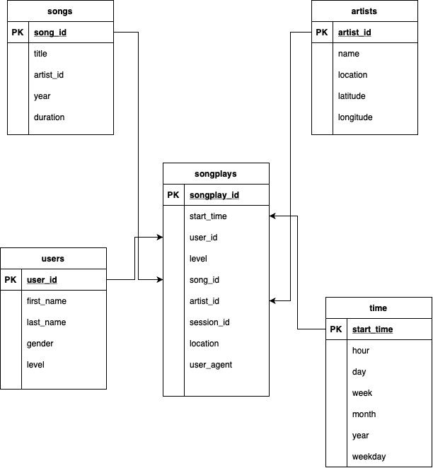

# Data Modeling with Postgres

The purpose of this database is to make it easier to analyze the data Sparkify is generating, and further to maximize growth and revenue. The unorderly data from a Song Dataset and a Log Dataset are converted into a star schema database, which makes it possible to analyze the data deeper and more intuitively. I would think that the new schema will also make it applicable to predictive analyses like machine learning to, for instance, find good next song suggestions.

This schema makes it fast and easy to make queries. It is normalized to the third degree, which makes it use atomic values, all columns rely on the Primary Key, and the tables have no transitive dependencies.

The ETL pipeline is set up so that all the create table queries are in a create_tables-py file, while the other queries are in a sql_queries.py file. The etl.py imports the queries from sql_queries.py and has the main function that sets up the connection to the database and runs the queries for the song dataset and the log dataset.

